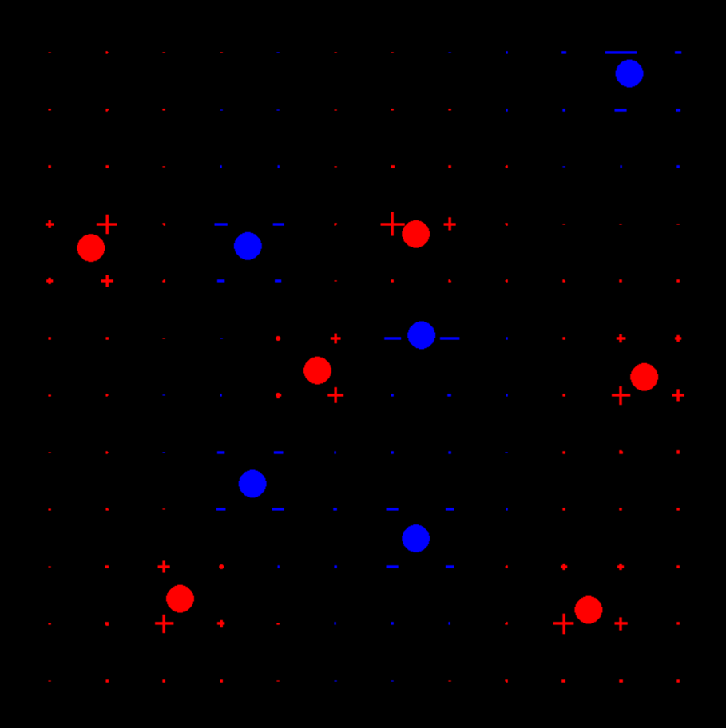

A simulation of electrostatic field using point charges. Used Python with Pygame to create a grid of point that will so the magnitude and sign of the electric field at that point, by either being red and a cross for positive or blue and a minus for negative. 
  - To add a point charge, use mouse click to add it at that position
  - To change sign of point charge, press q
  - To clear all point charges from the sim, press x
 
